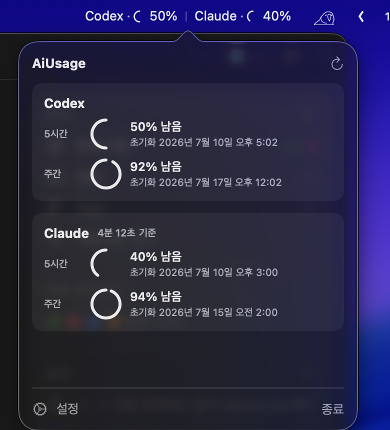

<p align="right">English | <a href="README.ko.md">한국어</a></p>

<p align="center">
  
</p>

<h1 align="center">AiUsage</h1>

<p align="center">
  See your remaining Codex and Claude usage directly in the macOS menu bar.
</p>

<p align="center">
  <a href="https://github.com/j3s30p/AI_Usage/releases/latest"></a>
  
  
  
</p>



AiUsage is a native macOS menu bar app that shows the current usage limits reported by Codex and Claude in one place. Check the remaining percentage and reset time without switching apps or running a command.

## Features

- **Codex and Claude together** — See both providers in one menu bar app.
- **Five-hour and weekly limits** — Check remaining percentages and reset times at a glance.
- **A menu bar that fits** — Choose names or logos, percentages, refresh timing, and optional usage-based ring colors.
- **Reliable background monitoring** — Keep the latest valid value through temporary failures and optionally launch at login.


## Install

### Homebrew

```bash
brew install --cask j3s30p/tap/aiusage
open -a AiUsage
```

To update an existing installation:

```bash
brew upgrade --cask aiusage
```

### Direct download

Download the universal macOS ZIP from the [latest GitHub Release](https://github.com/j3s30p/AI_Usage/releases/latest), extract it, and move `AiUsage.app` to Applications.

Release builds are signed with a Developer ID Application certificate and notarized by Apple. Both Apple Silicon and Intel Macs are supported.

## First launch

1. Select AiUsage in the menu bar and open **Settings**.
2. Use the **General** tab for app behavior and Claude connections, and the **Menu Bar** tab to choose providers, display style, refresh interval, and optional usage ring colors.
3. Codex works without another connection step when the local Codex CLI is signed in.
4. For Claude, keep the recommended `statusLine cache` mode, select **Connect Claude statusLine…** once, and approve the change. You do not need to enter commands or edit settings files manually.

Claude statusLine provides fresh usage after Claude Code's next response. AiUsage preserves a compatible existing statusLine and restores it when disconnected. Experimental OAuth mode is also available for compatible Claude Code credentials.

## Privacy and macOS permissions

AiUsage has no server of its own and includes no analytics SDK.

- Codex and Claude statusLine data are read locally.
- Prompts, conversations, account emails, session IDs, and working directories are not collected or logged.
- Screen Recording and Accessibility permissions are not required.

See [Architecture and data sources](docs/architecture.md) for the full data flow and security boundaries.

## Requirements

- macOS 14 Sonoma or later
- Codex display: Codex CLI installed and signed in
- Claude display: Claude Code installed and signed in to a Claude.ai Pro or Max account

API-key sessions without a shared subscription limit are not supported.

## Documentation

- [Architecture and data sources](docs/architecture.md)
- [Maintainer release process](docs/releasing.md)
- [Brand assets and attribution](BRAND_ASSETS.md)

---

AiUsage is not made or endorsed by OpenAI or Anthropic. Codex, OpenAI, Claude, and Anthropic trademarks and logos belong to their respective owners.
