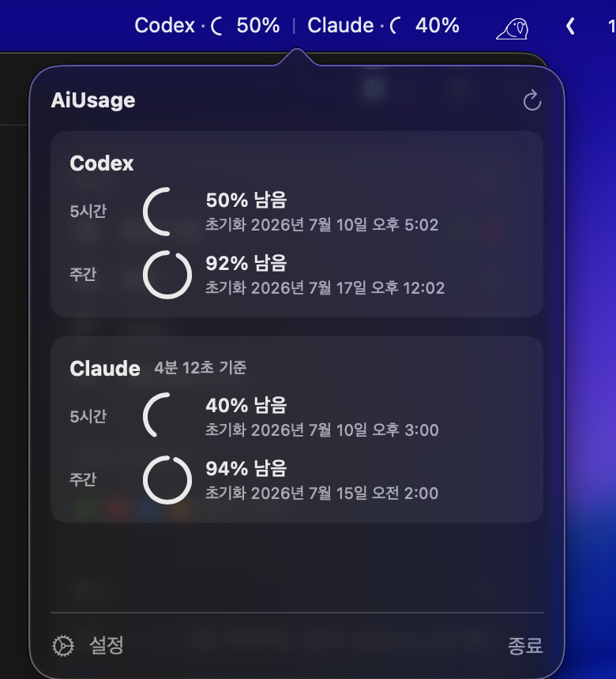

<p align="right">English | <a href="README.ko.md">한국어</a></p>

<p align="center">
  
</p>

<h1 align="center">AiUsage</h1>

<p align="center">
  See your remaining Codex and Claude usage directly in the macOS menu bar.
</p>

<p align="center">
  <a href="https://github.com/j3s30p/AI_Usage/releases/latest"></a>
  
  
  
</p>



AiUsage is a native macOS menu bar app that shows the current usage limits reported by Codex and Claude in one place. Check the remaining percentage and available reset times without switching apps or running a command.

## Features

- **Codex and Claude together** — See both providers in one menu bar app.
- **Five-hour and weekly limits** — Check remaining percentages and available reset times at a glance.
- **Desktop app support** — Use a Codex-enabled desktop app or Claude Desktop without a separate CLI installation.
- **A menu bar that fits** — Choose names or logos, percentages, refresh timing, and optional usage-based ring colors.
- **Reliable background monitoring** — Keep the last successful value visible between refreshes, mark delayed data, and optionally launch at login.


## Install

### Homebrew

```bash
brew install --cask j3s30p/tap/aiusage
open -a AiUsage
```

To update an existing installation:

```bash
brew upgrade --cask aiusage
```

### Direct download

Download the universal macOS ZIP from the [latest GitHub Release](https://github.com/j3s30p/AI_Usage/releases/latest), extract it, and move `AiUsage.app` to Applications.

Release builds are signed with a Developer ID Application certificate and notarized by Apple. Both Apple Silicon and Intel Macs are supported.

## First launch

1. Select AiUsage in the menu bar and open **Settings**.
2. Use the **General** tab for app behavior, Claude connections, and current/latest version information. Use the **Menu Bar** tab to choose providers, display style, refresh interval, and optional usage ring colors.
3. For Codex, sign in with your ChatGPT account in a Codex-enabled desktop app (ChatGPT/Codex). No separate CLI installation or terminal use is needed. Existing Codex CLI installations are also supported.
4. If you use only Claude Desktop, keep the recommended `Local caches` mode. No statusLine connection is required.
5. If you use Claude Code, select **Connect Claude statusLine…** once and approve the change. You do not need to enter commands or edit settings files manually.

AiUsage preserves a compatible existing Claude statusLine and restores it when disconnected. Experimental OAuth mode is also available for compatible Claude Code credentials.

## Usage updates

- **Codex:** updates when the desktop app or CLI writes a new usage record. Scheduled checks cover missed records and usage from other devices; the default interval is three minutes.
- **Claude local caches:** updates when a local usage file changes. Current statusLine data takes priority over Desktop history; the selected refresh interval remains a fallback.
- **Claude OAuth:** checks usage at the selected interval.

You do not need to open the popover. The menu bar keeps the last successful value visible and marks it when it is too old. Updates depend on when the source records usage: Claude Desktop normally writes about every five minutes, but may take longer. Its history does not include reset times.

File-driven updates do not start a model call or an extra Codex process. Scheduled Codex queries exit after each read to reduce idle memory.

AiUsage checks its signed Sparkle appcast at launch and every 24 hours. When a newer version is available, an update button appears in the menu bar popover and opens Sparkle's verified update flow.

## Privacy and macOS permissions

AiUsage has no server of its own and includes no analytics SDK.

- Codex uses local usage records and the desktop app or CLI's existing login. Claude local mode reads statusLine data or Desktop usage history.
- Claude Desktop history contains an organization identifier, but AiUsage ignores it and does not store or log it.
- Prompts, conversations, account emails, session IDs, and working directories are not collected or logged.
- Screen Recording and Accessibility permissions are not required.

See [Architecture and data sources](docs/architecture.md) for the full data flow and security boundaries.

## Requirements

- macOS 14 Sonoma or later
- Codex display: a Codex-enabled desktop app (ChatGPT/Codex) or Codex CLI, installed and signed in with ChatGPT
- Claude display: Claude Desktop or Claude Code installed and signed in to a Claude.ai Pro or Max account

API-key sessions without a shared subscription limit are not supported.
A browser-only login does not provide the local usage source required by AiUsage; a supported desktop app or CLI is needed.

## Documentation

- [Changelog (Korean)](CHANGELOG.md)
- [Architecture and data sources](docs/architecture.md)
- [Maintainer release process](docs/releasing.md)
- [Brand assets and attribution](BRAND_ASSETS.md)

---

AiUsage is not made or endorsed by OpenAI or Anthropic. Codex, OpenAI, Claude, and Anthropic trademarks and logos belong to their respective owners.
